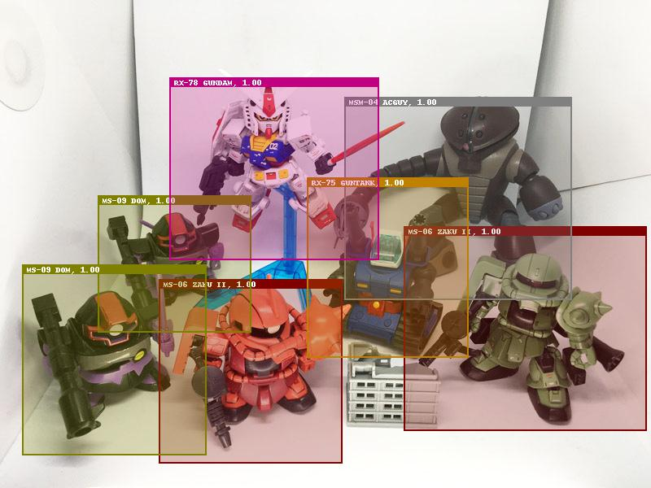
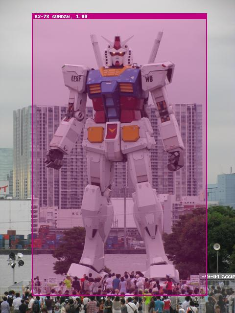
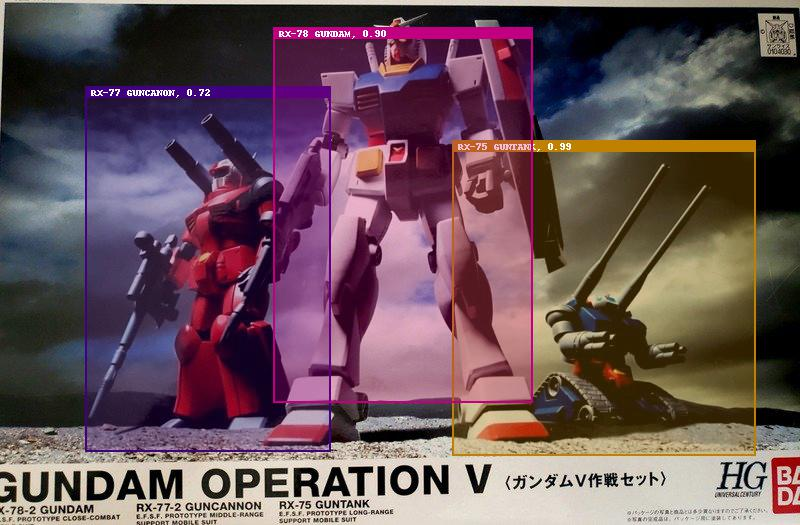

# GundamMS-SSD-ChainerCV

## Overview

Recognize Gundam's mobile suits using SSD-300.  
Supported frameworks are Chainer and ChainerCV.

* [Chainer](https://github.com/chainer/chainer)
* [ChainerCV](https://github.com/chainer/chainercv)

## Samples

## Mobile Suits labels

|no|name|
|---|---|
|MS-06  |ZAKU II|
|MS-07  |GOUF   |
|MS-09  |DOM    |
|MS-14  |GELGOOG|
|MS-15  |GYAN   |
|MSM-03 |GOGG   |
|MSM-04 |ACGUY  |
|MSM-07 |ZGOK   | 
|MSN-02 |ZEONG  |
|RGM-79 |GM     |
|RX-75  |GUNTANK|
|RX-77  |GUNCANON|
|RX-78  |GUNDAM |

## Usage

First, Downloading Pre-trained model file from my google-drive, and put it in root directory.  
https://drive.google.com/drive/folders/1L3KyEe_bc9LaFUmayfehCJ6qO35iupkj

### Single image file

[gundam_ms_ssd.ipynb](gundam_ms_ssd.ipynb)

### Web camera

[gundam_ms_ssd_webcam.ipynb](gundam_ms_ssd_webcam.ipynb)

## Contact

* [Twitter Heruheru3](https://twitter.com/heruheru3)
* [Web Site Heruheru3](https://heru3.com)